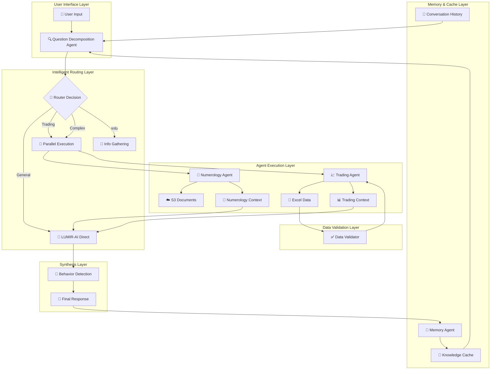
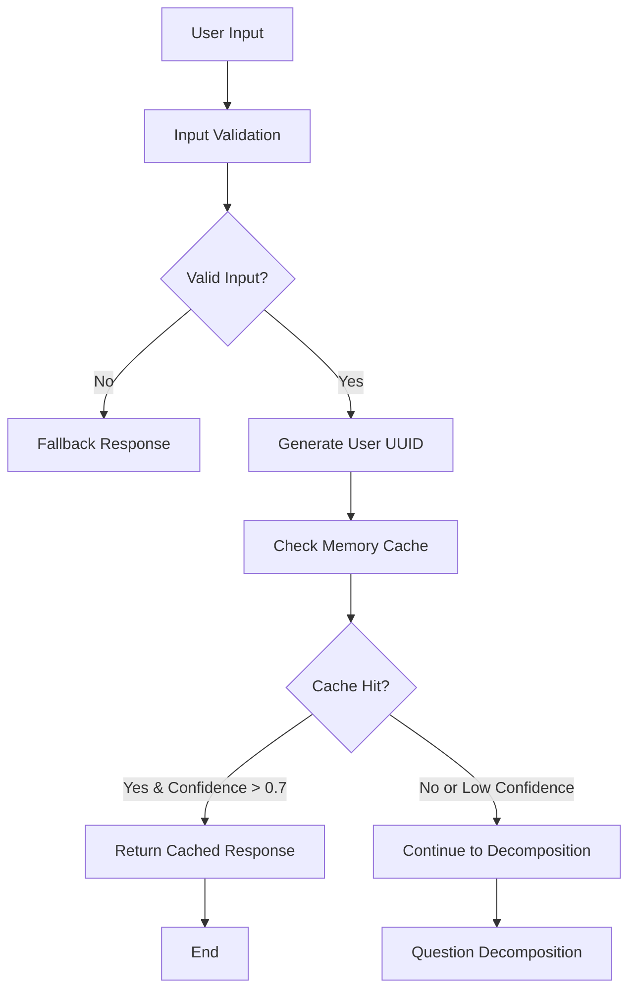
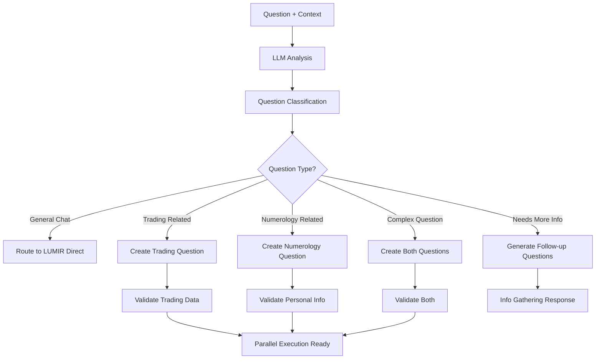
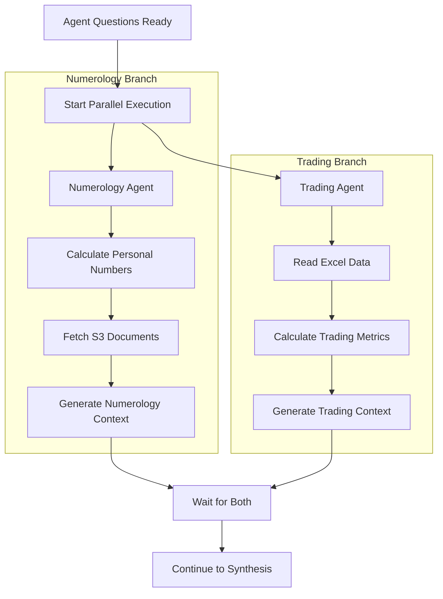
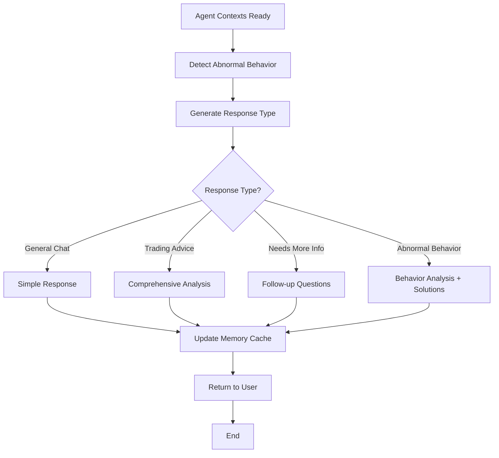
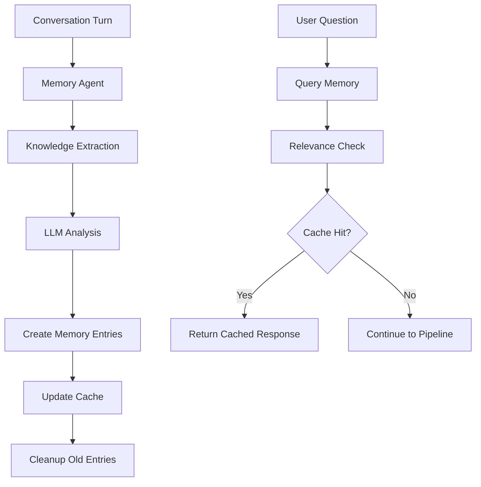
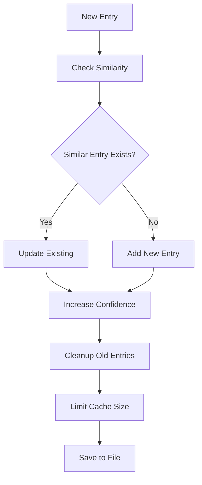
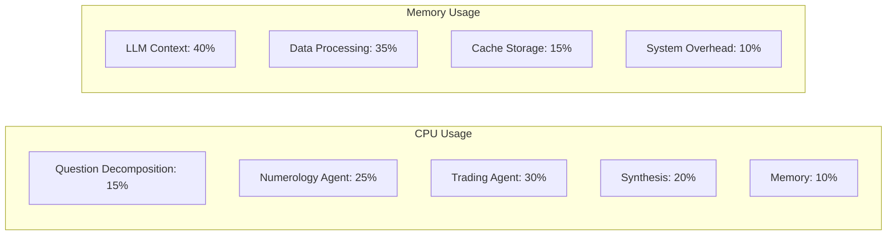
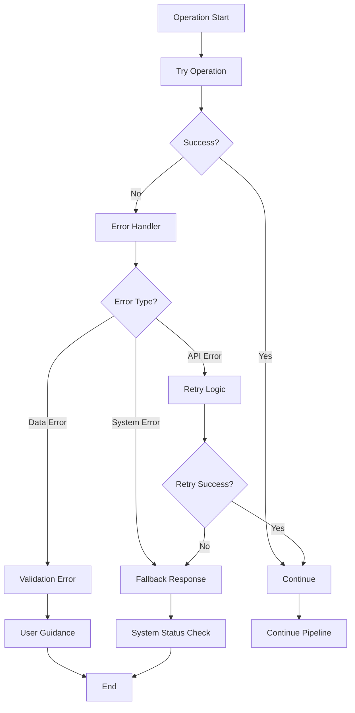
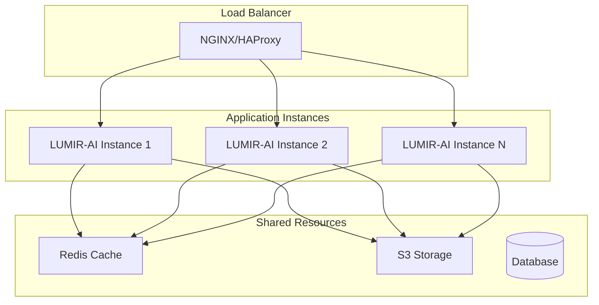

# 🏗️ KIẾN TRÚC CHI TIẾT LUMIR-AI SYSTEM

## 📊 **SƠ ĐỒ KIẾN TRÚC TỔNG THỂ**



## 🔄 **LUỒNG XỬ LÝ CHI TIẾT**

### **Phase 1: Input Processing & Memory Check**



**Chi tiết:**
1. **Input Validation**: Kiểm tra format và completeness
2. **UUID Generation**: Tạo unique ID từ user_name + birthday + username
3. **Memory Check**: Query cache với confidence threshold 0.7
4. **Cache Hit**: Trả lời nhanh từ cache (response time < 0.1s)

### **Phase 2: Question Decomposition & Routing**



**Chi tiết:**
1. **LLM Analysis**: Sử dụng OpenAI để phân tích ngữ nghĩa
2. **Question Classification**: 4 loại chính + complex cases
3. **Data Validation**: Kiểm tra Excel format và personal info
4. **Question Generation**: Tạo câu hỏi con cho từng agent

### **Phase 3: Parallel Agent Execution**



**Chi tiết:**
1. **Parallel Execution**: Sử dụng ThreadPoolExecutor với max_workers=2
2. **Numerology Processing**: Tính toán + fetch S3 docs
3. **Trading Processing**: Excel analysis + metrics calculation
4. **Synchronization**: Đợi cả 2 agent hoàn thành

### **Phase 4: Synthesis & Response Generation**



**Chi tiết:**
1. **Behavior Detection**: Pattern matching cho FOMO, revenge trading, etc.
2. **Response Generation**: Context-aware response creation
3. **Memory Update**: Cache knowledge từ conversation
4. **Final Response**: Formatted output với emojis và structure

## 🧠 **MEMORY SYSTEM ARCHITECTURE**

### **Memory Flow Diagram**



### **Memory Entry Structure**

```json
{
  "key": "trading_style",
  "summary": "User prefers swing trading with medium risk tolerance",
  "context": "Based on personality analysis and trading patterns",
  "timestamp": "2025-08-24T11:17:22.612146",
  "confidence": 0.95,
  "tags": ["trading", "personality", "risk_tolerance"],
  "source_turns": [1, 5]
}
```

### **Cache Management**



## 🔧 **AGENT INTERFACE SPECIFICATIONS**

### **Question Decomposition Agent**

**Input Schema:**
```python
{
    "question": str,                    # User question
    "user_name": Optional[str],         # User's name
    "birthday": Optional[str],          # Birth date (dd/mm/yyyy)
    "excel_path": Optional[str],        # Excel file path
    "language": str = "vi",            # Language preference
    "username": Optional[str],          # Username
    "conversation_history": List[Dict]  # Recent conversation turns
}
```

**Output Schema:**
```python
{
    "question_type": str,               # Classification result
    "should_call_agents": bool,         # Whether to call specialized agents
    "numerology_question": Optional[str], # Question for numerology agent
    "trading_question": Optional[str],   # Question for trading agent
    "reasoning": str,                   # Explanation for routing decision
    "focus_areas": List[str],           # Areas of focus
    "needs_user_info": bool,            # Whether more info is needed
    "suggested_questions": List[str]    # Follow-up questions
}
```

### **Numerology Agent**

**Input Schema:**
```python
{
    "question": str,           # Specific numerology question
    "user_name": str,          # User's full name
    "birthday": str            # Birth date (dd/mm/yyyy)
}
```

**Output Schema:**
```python
{
    "numerology_context": str,  # Formatted numerology analysis
    "personal_numbers": Dict,   # Calculated personal numbers
    "insights": List[str],      # Key insights and recommendations
    "trading_style": str        # Recommended trading approach
}
```

### **Trading Agent**

**Input Schema:**
```python
{
    "question": str,           # Trading analysis question
    "excel_path": str          # Path to Excel trading data
}
```

**Output Schema:**
```python
{
    "trading_context": str,    # Formatted trading analysis
    "metrics": Dict,           # Calculated trading metrics
    "performance": Dict,       # Performance analysis
    "risk_assessment": Dict,   # Risk analysis
    "recommendations": List[str] # Trading recommendations
}
```

### **LUMIR-AI Synthesis Agent**

**Input Schema:**
```python
{
    "question": str,                    # Original user question
    "question_type": str,               # Question classification
    "numerology_context": str,          # Context from numerology agent
    "trading_context": str,             # Context from trading agent
    "user_name": str,                   # User's name
    "username": str,                    # Username
    "language": str,                    # Language preference
    "has_trading_data": bool,           # Whether trading data is available
    "focus_areas": List[str],           # Areas of focus
    "needs_user_info": bool,            # Whether more info is needed
    "suggested_questions": List[str],   # Follow-up questions
    "conversation_history": List[Dict]  # Conversation history
}
```

**Output Schema:**
```python
{
    "response": str,                    # Final response to user
    "response_type": str,               # Type of response generated
    "abnormal_behaviors": List[str],    # Detected abnormal behaviors
    "recommendations": List[str],       # Specific recommendations
    "follow_up_questions": List[str]    # Additional questions if needed
}
```

## 📊 **PERFORMANCE CHARACTERISTICS**

### **Response Time Breakdown**

```mermaid
gantt
    title Response Time Breakdown
    dateFormat  X
    axisFormat %s
    
    section Memory Check
    Cache Query           :0, 0.1s
    Cache Hit Response    :0.1s, 0.2s
    
    section Full Pipeline
    Question Decomposition :0, 1.5s
    Parallel Execution     :1.5s, 4s
    Synthesis             :4s, 5s
    Memory Update         :5s, 5.2s
```

### **Performance Metrics**

| Component | Average Time | Range | Notes |
|-----------|--------------|-------|-------|
| Memory Check | 0.1s | 0.05-0.2s | Cache hit scenario |
| Question Decomposition | 1.5s | 1.0-2.5s | LLM processing |
| Numerology Agent | 2.5s | 2.0-4.0s | S3 fetch + calculation |
| Trading Agent | 2.0s | 1.5-3.0s | Excel processing |
| Synthesis | 1.0s | 0.8-1.5s | Final response generation |
| **Total (Cache Miss)** | **5.0s** | **4.0-7.0s** | Full pipeline |
| **Total (Cache Hit)** | **0.2s** | **0.1-0.3s** | Memory response |

### **Resource Utilization**



## 🔒 **SECURITY & ERROR HANDLING**

### **Error Handling Flow**



### **Security Measures**

1. **Input Validation**: Sanitize all user inputs
2. **API Key Protection**: Environment variables only
3. **Data Isolation**: User-specific cache files
4. **Error Logging**: No sensitive data in logs
5. **Rate Limiting**: Prevent abuse

## 🚀 **SCALABILITY CONSIDERATIONS**

### **Horizontal Scaling**



### **Performance Optimization**

1. **Async Processing**: Non-blocking I/O operations
2. **Connection Pooling**: Reuse database connections
3. **Caching Strategy**: Multi-level caching (memory + Redis)
4. **Batch Processing**: Process multiple requests together
5. **Resource Pooling**: Shared agent instances

---

**Tài liệu này cung cấp cái nhìn chi tiết về kiến trúc LUMIR-AI System.**
**Để biết thêm thông tin, xem README.md chính.**
