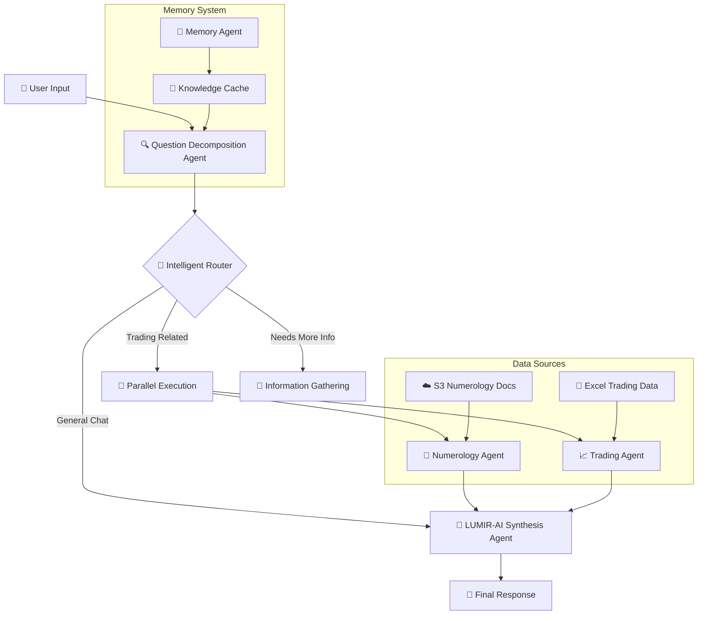
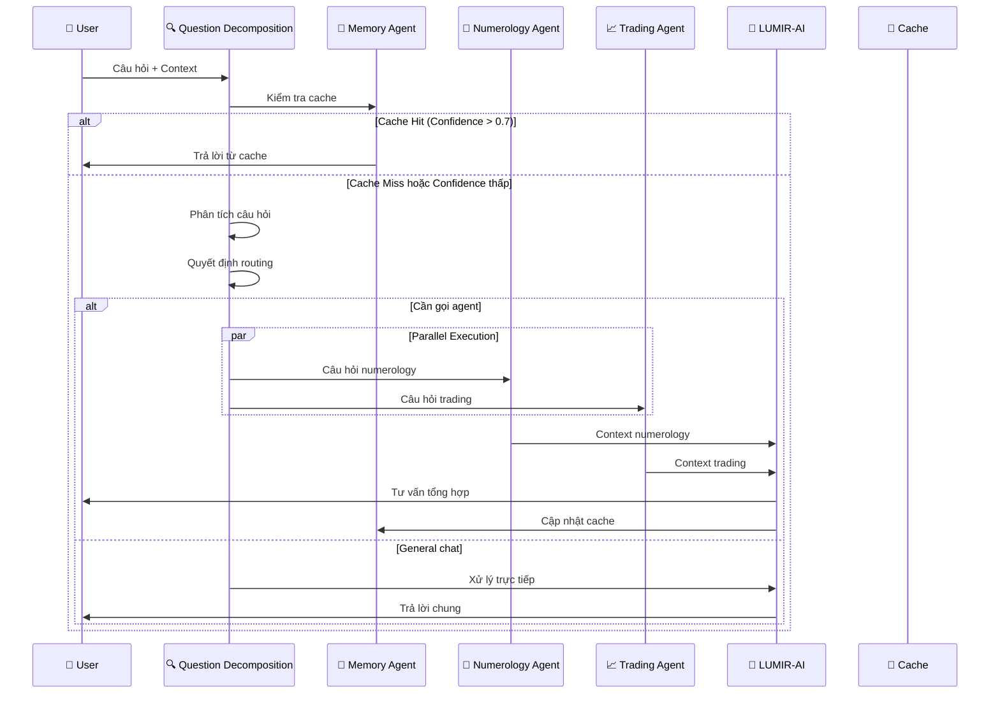
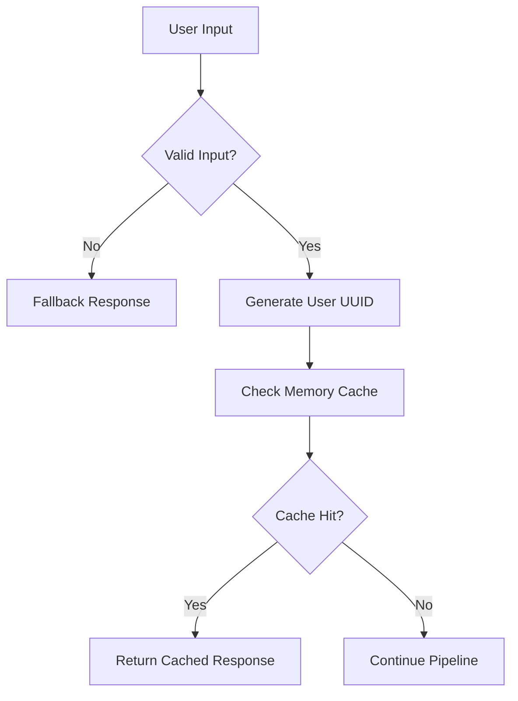
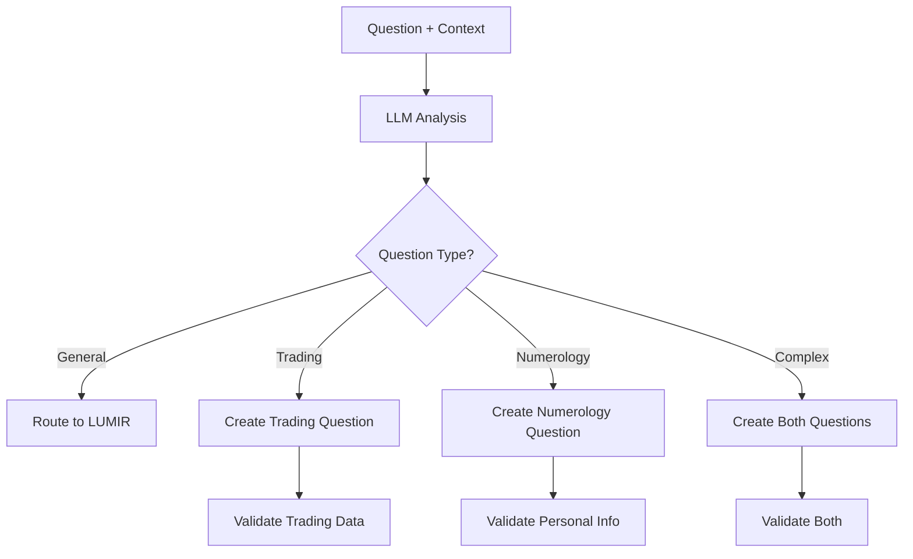
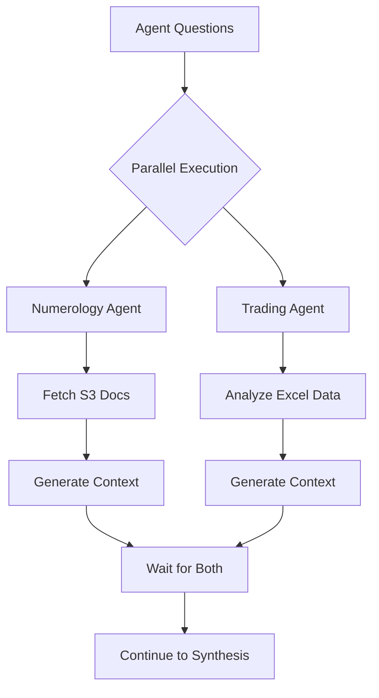
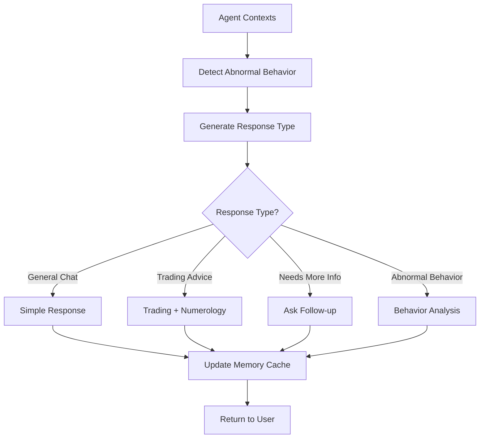

# 🚀 LUMIR-AI: Hệ Thống Chatbot Đa Agent Thông Minh

## 📋 **TỔNG QUAN**

LUMIR-AI là một hệ thống chatbot thông minh được thiết kế để tư vấn giao dịch (trading) và huấn luyện kiểm soát cảm xúc. Hệ thống sử dụng kiến trúc đa agent với khả năng phân tích thông minh, routing động và memory multi-turn chat.

## 🏗️ **KIẾN TRÚC HỆ THỐNG**

### **Sơ Đồ Tổng Quan**



### **Luồng Xử Lý Chi Tiết**



## 🔧 **CÁC THÀNH PHẦN CHÍNH**

### **1. 🔍 Question Decomposition Agent**

**Chức năng:**
- Phân tích câu hỏi user một cách thông minh
- Quyết định có cần gọi agent chuyên biệt không
- Tạo câu hỏi con cho từng agent
- Validate dữ liệu trading

**Input:**
- Câu hỏi user
- Thông tin cá nhân (tên, ngày sinh)
- Đường dẫn file Excel
- Lịch sử hội thoại

**Output:**
```json
{
  "question_type": "trading_related|numerology_related|general_chat|needs_more_info",
  "should_call_agents": true|false,
  "numerology_question": "Câu hỏi cho numerology agent",
  "trading_question": "Câu hỏi cho trading agent",
  "reasoning": "Lý do routing",
  "focus_areas": ["trading", "emotion", "personality"],
  "needs_user_info": true|false,
  "suggested_questions": ["Câu hỏi gợi ý"]
}
```

### **2. 🔮 Numerology Agent**

**Chức năng:**
- Phân tích tính cách và tâm lý dựa trên thần số học
- Tính toán các chỉ số cá nhân
- Fetch tài liệu từ S3
- Đưa ra insights về phong cách trading phù hợp

**Chỉ số chính:**
- `life_path`: Chỉ số đường đời (60% khả năng thành công)
- `personal_day`: Chỉ số ngày cá nhân
- `soul`: Khát khao sâu thẳm
- `personality`: Ấn tượng đầu tiên
- `balance`: Cách phản ứng khi thị trường biến động

### **3. 📈 Trading Agent**

**Chức năng:**
- Đọc và phân tích dữ liệu Excel
- Tính toán các chỉ số trading
- Phân tích hiệu suất và rủi ro
- Tạo báo cáo tổng quan

**Chỉ số trading:**
- Tổng số lệnh, win rate, profit factor
- Max drawdown, consecutive losses
- Risk-adjusted returns
- Trading patterns và behaviors

### **4. 🤖 LUMIR-AI Synthesis Agent**

**Chức năng:**
- Tổng hợp context từ các agent
- Phát hiện hành vi lệch chuẩn (FOMO, revenge trading)
- Đưa ra tư vấn toàn diện
- Quản lý memory multi-turn chat

**Khả năng phát hiện:**
- **FOMO**: Sợ bỏ lỡ cơ hội
- **Revenge Trading**: Giao dịch trả thù
- **Overtrading**: Giao dịch quá nhiều
- **Emotional Trading**: Giao dịch theo cảm xúc

### **5. 🧠 Memory Agent**

**Chức năng:**
- Tóm tắt conversation thành knowledge cache
- Query cache để trả lời nhanh
- Quản lý cache theo user UUID
- Tự động cleanup và refresh

**Memory Structure:**
```json
{
  "key": "trading_style",
  "summary": "Tóm tắt kiến thức",
  "context": "Context liên quan",
  "timestamp": "2025-08-24T11:17:22",
  "confidence": 0.95,
  "tags": ["trading", "personality"],
  "source_turns": [1, 5]
}
```

## 🔄 **PIPELINE XỬ LÝ CHI TIẾT**

### **Bước 1: Input Validation & Memory Check**


### **Bước 2: Question Decomposition**


### **Bước 3: Parallel Agent Execution**


### **Bước 4: Synthesis & Response Generation**


## 📊 **CÁC LOẠI RESPONSE**

### **1. General Chat Response**
- Câu hỏi đơn giản, không liên quan trading
- Trả lời trực tiếp từ LUMIR-AI
- Không gọi agent chuyên biệt

### **2. Trading Advice Response**
- Kết hợp context từ cả 2 agent
- Phân tích hiệu suất và tính cách
- Đưa ra khuyến nghị cụ thể

### **3. Information Gathering Response**
- Khi thiếu thông tin để trả lời
- Gợi ý câu hỏi follow-up
- Hướng dẫn cung cấp thêm data

### **4. Abnormal Behavior Response**
- Phát hiện hành vi lệch chuẩn
- Phân tích nguyên nhân
- Đưa ra giải pháp cụ thể

## 🧪 **TESTING & DEMO**

### **File Test Chính:**
- `test_infer.py`: Test hệ thống với input tùy chỉnh
- Hỗ trợ test đơn lẻ, multi-turn, system status

### **Cách Sử Dụng:**
```bash
# Test câu hỏi đơn lẻ
python test_infer.py

# Test multi-turn chat
python test_infer.py
# Nhập 'chat' khi được hỏi

# Kiểm tra system status
python test_infer.py
# Nhập 'status' khi được hỏi
```

## 🔧 **CÀI ĐẶT & CẤU HÌNH**

### **Dependencies:**
```bash
pip install -r requirements.txt
```

### **Environment Variables:**
```bash
OPENAI_API_KEY=your_api_key
OPENAI_BASE_URL=your_base_url
MODEL_NAME=your_model_name
```

### **Cấu trúc thư mục:**
```
rag-agentic-parlant/
├── agents/                 # Các agent chính
│   ├── question_decomposition_agent.py
│   ├── numerology_agent.py
│   ├── trading_agent.py
│   ├── lumir_synthesis_agent.py
│   ├── memory_agent.py
│   └── multi_agent_orchestrator.py
├── tools/                  # Công cụ hỗ trợ
│   ├── trading_tool.py
│   ├── numerology_tool.py
│   └── data_validator_tool.py
├── prompts/                # Prompt templates
├── .memory_cache/          # Memory cache files
├── config.py               # Cấu hình hệ thống
└── test_infer.py          # File test chính
```

## 🎯 **ƯU ĐIỂM HỆ THỐNG**

### **1. Intelligent Routing**
- Không dựa trên keyword matching cứng nhắc
- LLM-driven decision making
- Adaptive routing dựa trên context

### **2. Parallel Execution**
- Chạy song song các agent
- Tối ưu response time
- Efficient resource utilization

### **3. Smart Memory System**
- Cache knowledge quan trọng
- Trả lời nhanh từ cache
- Multi-turn context awareness

### **4. Comprehensive Analysis**
- Kết hợp trading data + personality
- Phát hiện abnormal behaviors
- Tư vấn cá nhân hóa

### **5. Multi-language Support**
- Hỗ trợ tiếng Việt và tiếng Anh
- Context-aware language selection
- Localized responses

## 🚀 **ROADMAP & PHÁT TRIỂN**

### **Phase 1: Core System ✅**
- [x] Multi-agent architecture
- [x] Intelligent routing
- [x] Memory system
- [x] Basic testing

### **Phase 2: Enhancement 🔄**
- [ ] Advanced behavior detection
- [ ] Performance optimization
- [ ] Extended trading metrics
- [ ] User feedback system

### **Phase 3: Advanced Features 📋**
- [ ] Real-time market data integration
- [ ] Advanced NLP capabilities
- [ ] Machine learning integration
- [ ] Mobile app support

## 🤝 **ĐÓNG GÓP & HỖ TRỢ**

### **Báo cáo lỗi:**
- Tạo issue với mô tả chi tiết
- Include error logs và steps to reproduce

### **Đóng góp code:**
- Fork repository
- Tạo feature branch
- Submit pull request với mô tả rõ ràng

### **Liên hệ:**
- Email: [your-email]
- GitHub: [your-github]

## 📄 **LICENSE**

MIT License - Xem file `LICENSE` để biết thêm chi tiết.

---

**LUMIR-AI** - Hệ thống chatbot thông minh cho trading và kiểm soát cảm xúc 🚀
